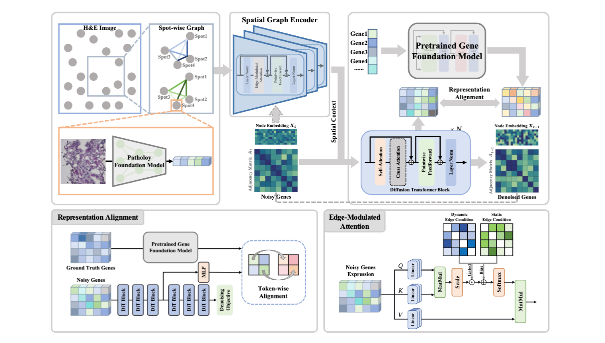

# FLAG: Foundation model representation with Latent diffusion Alignment via Graph for spatial gene expression prediction

[](https://icml.cc/)
[](LICENSE)

This is the official PyTorch implementation of the paper "FLAG: Foundation model representation with Latent diffusion Alignment via Graph for spatial gene expression prediction", accepted at ICML 2026.

🚨 COMING SOON: We are currently cleaning up and refactoring the codebase. The full official PyTorch implementation will be publicly released here in the coming months. Thanks for your patience! 🚨

📖 Abstract

Current gene prediction models mostly treat gene expression as a series of isolated pointwise tasks. While effective for numerical fitting, this approach overlooks crucial biological structures: the functional coordination between genes and their organized distribution across tissue.

FLAG reframes this task as structured distribution modeling. To gracefully overcome this, FLAG introduces:

1. Spatial Graph Encoder: Captures spatial topological relationships between tissue spots, providing spatial embeddings as conditioning signals to guide the gene-level diffusion process.

2. Gene Foundation Model (GFM) Alignment: Aligns the intermediate representations of the diffusion model with the pre-trained embedding space of large-scale GFMs (e.g., Geneformer/scGPT), ensuring high gene-gene structural fidelity during generation.

3. Furthermore, to rigorously assess structural preservation, we propose two novel structure-aware evaluation metrics: Gene Structural Correlation (GSC) and Spatial Structural Correlation (SSC).

🏗️ FLAG Framework

The left module uses a pathology foundation model to extract H&E features and construct a spatial graph. The right module employs a Conditional Diffusion Transformer (DiT) guided by the spatial graph context to denoise gene expressions, while an intermediate GFM alignment loss jointly enforces spatial coherence and biological structural fidelity.
<p align="center">
  
</p>

📝 Citation
If you find our code, concepts (like the Gene Dimension Curse), or metrics (GSC/SSC) useful in your research, please consider citing our paper:
```bibtex
@inproceedings{si2026flag,
  title={FLAG: Foundation model representation with Latent diffusion Alignment via Graph for spatial gene expression prediction},
  author={Qi Si and Penglei Wang and Yushuai Wu and Yifeng Jiao and Xuyang Liu and Xin Guo and Yuan Qi and Yuan Cheng},
  booktitle={Proceedings of the 43rd International Conference on Machine Learning (ICML)},
  year={2026}
}
```